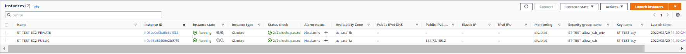

# AWS VPC Creation with Terraform
This project will create a VCP with Internet Gateway, subnets accross 2 AZs: one public
and one one private.

From there terraform will be used to deploy a bastion host in the public subnet in AZ1 and a second host
in the private subnet in AZ2, which can connect to the internet via a NAT gateway created
as part of the VPC.

An SSH key pair is dynamically generated as well, and the private key is copied over to the
bastion host.

The ec2 instance in the public subnet is assigned a security group with access from the 
the intenret via port 22 (for ssh).

The ec2 instance in the private subnet is assigned to a security group that only allows
ssh access only from connections in the public subnet.

Both security groups are dynamically created in the network module.

## High level diagram

This is a Snipping Tool capture of img/demo-tform-aws-vpc.drawio diagram

## Current state

Modules:

The code is broken into three different modules: 
1) Networking (define the VPC and all of its components) 
2) SSH-Key (dynamically create an SSH-key pair for connecting to VMs) 
3) EC2 (deploy a VM in the public subnet, and deploy another VM in a private subnet) 

Module 1 – Networking 
- What this code will do: 
- Create a custom VPC 
- Define VPC name 
- Create an Internet Gateway and a NAT gateway 
- Define CIDR blocks 
- Deploy two public subnets, across two different AZs 
- Deploy two private subnets, across two different AZs 
- Create two security groups (one for public, and one for private access) 

Module 2 – SSH–Key 
- What this code will do: 
- Dynamically create an SSH Key pair that will be associated with the EC2 instances  
- This SSH Key will be created dynamically, and be deleted along with all the other resources provisioned with Terraform. 

Module 3 – EC2 
- What this code will do:  
- Create a t2.micro AWS Linux VM in the PUBLIC subnet for use as a bastion/gateway host. 
- Terraform will copy the SSH Key from your local system to the VM and apply appropriate file permissions to it. 
- This key will be used for connections to instances in the private subnet 
- Create a t2.micro AWS Linux VM in the PRIVATE subnet 

## Requirements
Note: In order to follow this demo VPC test you will need to have Terraform installed and configured and access to AWS Account to apply changes and view updates  

## Providers
AWS

## Inputs

| Name | Description | Type | Default | Required |
|------|-------------|------|---------|:--------:|
| namespace | The project namespace to use for unique resource naming | `string` | `"ST-TEST"` | no |
| region | AWS region | `string` | `"us-east-1"` | no |

## Outputs

| Name | Description |
|------|-------------|
| private\_connection\_string | You are in the ST-TEST private ec2 instance |
| public\_connection\_string | You are in the ST-TEST public ec2 instance |

## Terraform Output (example output in tf_output directory)

“terraform init”  
- This will initialize the working directory that contains a Terraform configuration code with modules and plugins from HashiCorp. 

“terraform plan followed by apply”
- This will first show an execution plan and report the resources to be deployed in AWS (23 resources in this example). 
- Once you confirm by typing “yes,” Terraform will begin provisioning the VPC, EC2 instances, and the SSH-key pair in AWS. 

“terraform destroy” 
- The “terraform destroy” command is used to destroy the Terraform-managed infrastructure. This will ask for confirmation before destroying. 
- Once you confirm by typing “yes,” Terraform will delete all of the 23 AWS resources it created earlier. 
- (Note: This will only destroy resources provisioned from the current project, nothing else.) 

## Resources
Once Terraform has completed provisioning resources, it will output a string you can copy and paste to the command line in order connect to your EC2 instances. 
I defined this to be the output code as a convenience. 

Outputs: 

- private_connection_string = ssh -i <namespace>-key.pem ec2-user@<private IP address> 
  public_connection_string = ssh -i <namespace>-key.pem ec2-user@<public IP address> 

Example
  - Apply complete! Resources: 23 added, 0 changed, 0 destroyed.
  - Outputs:
  - private_connection_string = ssh -i ST-TEST-key.pem ec2-user@10.0.2.157
  - public_connection_string = ssh -i ST-TEST-key.pem ec2-user@184.73.105.2

Now you can connect to the public EC2 instance using the public connection string, and once you are logged in to that VM, you can connect to the private EC2 instance with the private connection string.

ssh -i ST-TEST-key.pem ec2-user@184.73.105.2
The authenticity of host '184.73.105.2 (184.73.105.2)' can't be established.
ECDSA key fingerprint is SHA256:LF/QFykMPWtqp0NLkZQ8JP7/qe8GbTiHE49uMslZWZU.
Are you sure you want to continue connecting (yes/no)? yes
Warning: Permanently added '184.73.105.2' (ECDSA) to the list of known hosts.
Last login: Tue Mar 29 15:51:00 2022 from 136.226.53.96

       __|  __|_  )
       _|  (     /   Amazon Linux 2 AMI
      ___|\___|___|

https://aws.amazon.com/amazon-linux-2/
[ec2-user@ip-10-0-101-29 ~]$
 
(connecting to EC2 in public subnet from local host) 

ssh -i ST-TEST-key.pem ec2-user@10.0.2.157
The authenticity of host '10.0.2.157 (10.0.2.157)' can't be established.
ECDSA key fingerprint is SHA256:LF/QFykMPWtqp0NLkZQ8JP7/qe8GbTiHE49uMslZWZU.
Are you sure you want to continue connecting (yes/no)? yes
Warning: Permanently added '10.0.2.157' (ECDSA) to the list of known hosts.
Last login: Tue Mar 29 15:52:00 2022 from 136.226.53.96

       __|  __|_  )
       _|  (     /   Amazon Linux 2 AMI
      ___|\___|___|

https://aws.amazon.com/amazon-linux-2/
[ec2-user@ip-10-0-2-157 ~]$

(connecting to EC2 in private subnet from bastion host) 

To see all the components provisioned with Terraform, log into the AWS web console, and click the VPC and EC2 dashboards (make sure you are in the correct AWS region). 

